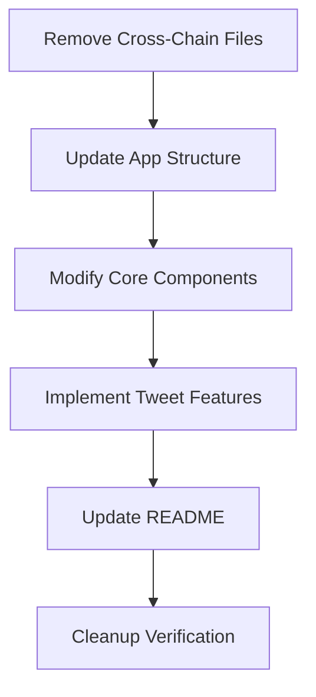

# Implementation Plan: Tweet-Powered Raydium Coin Launcher

## Objective
Remove cross-chain functionality and implement tweet-powered Raydium coin launcher



## Phase 1: Remove Cross-Chain Files
1. Delete directories:
   - `src/components/cross-chain/`
   - `src/hooks/cross-chain/`
   - `src/types/cross-chain/`
   - `src/lib/bridges/`
   - `src/lib/chains/`
   - `src/lib/deployment/`

2. Remove files:
   - `src/config/bridges.ts`
   - `src/config/chains.ts`
   - `src/config/deployment.ts`
   - `src/components/cross-chain/CrossChainTokenCreator.tsx`
   - `src/components/cross-chain/ChainSelector.tsx`
   - `src/components/cross-chain/MultiChainWalletProvider.tsx`

## Phase 2: Update App Structure
1. Modify `src/app/layout.tsx`:
   - Replace `MultiChainWalletProvider` with standard Solana wallet provider
   - Remove chain selector UI components

2. Update `src/app/page.tsx`:
   - Remove cross-chain token creator
   - Implement `TweetFeed` as main component

## Phase 3: Modify Core Components
1. Update `src/components/WalletProvider.tsx`:
   - Simplify to Solana-only implementation
   - Remove multi-chain connection logic

2. Refactor `src/components/TokenLaunchModal.tsx`:
   - Remove cross-chain parameters
   - Add tweet-based token parameters (name, symbol from tweet content)

## Phase 4: Implement Tweet Features
1. Complete `src/components/tweet/TweetFeed.tsx`:
   - Implement Twitter API integration
   - Add "Launch Coin" button functionality
   - Create favorite creators management

2. Enhance `src/components/tweet/TokenLaunchModal.tsx`:
   - Add tweet content prefill
   - Implement confirmation flow
   - Add post-launch actions (Solscan link, share buttons)

3. Build backend services:
   - Complete `src/services/twitterApi.ts`
   - Implement `src/app/api/twitter/route.ts`

## Phase 5: Update README
Replace content with new tweet-powered spec:
```markdown
🧾 Web App Spec: Tweet-Powered Raydium Coin Launcher
Overview
This web app serves as a discovery + launchpad for meme coins...
```

## Phase 6: Cleanup Verification
1. Remove cross-chain dependencies from package.json
2. Search codebase for "cross-chain" references
3. Verify app builds without errors
4. Test core tweet-to-token flow